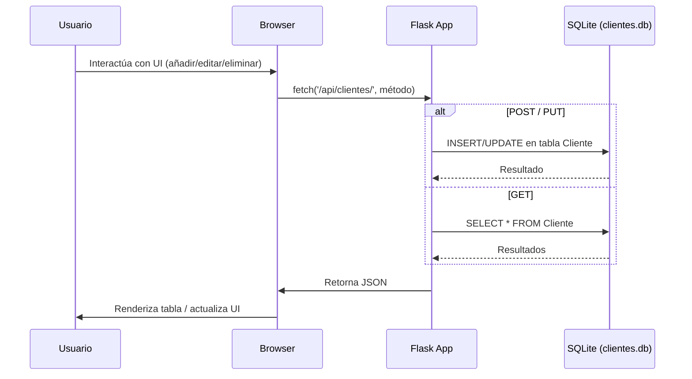

# Visión General del Proyecto

El proyecto es un **CRM básico** diseñado para gestionar clientes a través de una API RESTful y una interfaz web sencilla.  
- **Backend**: Flask con SQLAlchemy, que expone endpoints CRUD sobre la entidad `Cliente`.  
- **Frontend**: Una única página HTML servida por Flask que consume la API mediante fetch y ofrece funcionalidades de búsqueda, creación, edición y borrado en tiempo real usando Bootstrap 5.  

El flujo es el siguiente: el usuario interactúa con la UI, ésta envía peticiones HTTP al backend, este persiste los datos en una base SQLite y devuelve JSON que la página renderiza dinámicamente.

---

## Arquitectura del Sistema

| Componente | Tecnologías | Responsabilidad |
|------------|-------------|-----------------|
| **Flask App** | `app.py`, `backend/__init__.py` | Inicializa el servidor, configura la DB y registra blueprints. |
| **Modelo Cliente** | `backend/models.py` | Define la tabla SQLite con campos: id, nombre_completo, empresa, email (único), telefono, fecha_registro, status (enum). |
| **API REST** | `backend/routes.py` | Endpoints `/api/clientes/`: GET, POST, PUT, DELETE. Incluye validación de datos y manejo de errores. |
| **Frontend** | `frontend/index.html`, JS inline | UI CRUD con Bootstrap; consume la API mediante fetch. |
| **Tests** | `tests/test_backend.py` | Verifica funcionalidad CRUD y manejo de base de datos en entorno aislado. |

```mermaid
flowchart TD
    A[Usuario] --> B[Browser]
    B --> C{Fetch API}
    C --> D[/api/clientes/ (GET, POST, PUT, DELETE)]
    D --> E[Flask App]
    E --> F[SQLAlchemy ORM]
    F --> G[SQLite DB: clientes.db]
    G --> F
    E --> H[Return JSON]
    H --> B
```

---

## Endpoints de la API

| Método | Ruta | Parámetros | Cuerpo (JSON) | Respuesta | Código |
|--------|------|------------|---------------|-----------|--------|
| `GET` | `/api/clientes/` | ninguno | — | Lista de clientes en formato JSON. | 200 |
| `POST` | `/api/clientes/` | ninguno | `{ nombre_completo, empresa?, email, telefono?, status }` | Cliente creado con ID. | 201 |
| `PUT` | `/api/clientes/<int:cliente_id>` | `<cliente_id>` | Campos opcionales a actualizar (`nombre_completo`, `empresa`, `email`, `telefono`, `status`). | Cliente actualizado. | 200 |
| `DELETE` | `/api/clientes/<int:cliente_id>` | `<cliente_id>` | — | Mensaje de confirmación. | 200 |

### Ejemplo de Payload

```json
{
  "nombre_completo": "Ana García",
  "empresa": "Beta S.A.",
  "email": "ana@beta.com",
  "telefono": "555-1234",
  "status": "Potencial"
}
```

---

## Instrucciones de Instalación y Ejecución

1. **Clonar el repositorio**  
   ```bash
   git clone https://github.com/tuusuario/crm-basico.git
   cd crm-basico
   ```

2. **Crear entorno virtual (opcional pero recomendado)**  
   ```bash
   python -m venv .venv
   source .venv/bin/activate  # Windows: .\.venv\Scripts\activate
   ```

3. **Instalar dependencias**  
   ```bash
   pip install -r requirements.txt
   ```

4. **Ejecutar la aplicación**  
   ```bash
   python app.py
   ```
   La API estará disponible en `http://127.0.0.1:5000/api/clientes/` y el frontend en `http://127.0.0.1:5000/`.

5. **Ejecutar pruebas unitarias**  
   ```bash
   pytest tests/test_backend.py
   ```

---

## Flujo de Datos Clave



---

## Extensiones Futuras (Opcional)

| Área | Posible Mejora |
|------|----------------|
| **Autenticación** | Integrar JWT o OAuth para proteger endpoints. |
| **Pagination & Sorting** | Añadir parámetros `page`, `limit`, `sort_by` a GET. |
| **Validaciones Avanzadas** | Usar Marshmallow/Flask‑RESTful para schemas y validación más robusta. |
| **Front‑end SPA** | Migrar a React/Vue con Axios, mejorando la experiencia de usuario. |
| **Dockerización** | Crear `Dockerfile` y `docker-compose.yml` para despliegue reproducible. |
| **CI/CD** | Añadir pipelines GitHub Actions para pruebas automáticas y despliegue. |

---