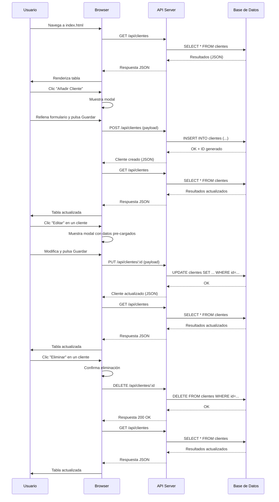

# Visión General del Proyecto

Este proyecto es un **CRM básico** diseñado para la gestión de clientes en una pequeña empresa. La aplicación está compuesta por una interfaz web sencilla que permite:

- Listar clientes con sus datos principales (nombre, empresa, email y estado).
- Añadir nuevos clientes mediante un modal.
- Editar los datos existentes.
- Eliminar clientes.
- Filtrar la lista en tiempo real usando un campo de búsqueda.

La lógica está implementada en JavaScript ES6 puro y se apoya en **Bootstrap 5** para el estilo y componentes UI. La comunicación con el backend se realiza a través de una API RESTful expuesta bajo el prefijo `/api/clientes`.

---

# Arquitectura del Sistema

## Estructura de archivos

```
index.html          # Página principal con la interfaz de usuario
└─ static/
   ├─ css/          # (opcional) Estilos personalizados
   └─ js/           # (opcional) Scripts modularizados
```

La aplicación es **single‑page**: todo el flujo se maneja en el navegador sin recargas de página. El único punto de interacción con el servidor es la API REST que devuelve y recibe datos en formato JSON.

## Diagrama Mermaid

```mermaid
graph TD
    A[Usuario] -->|Interacción UI| B[Browser]
    B -->|GET /api/clientes| C[API Server]
    B -->|POST/PUT/DELETE /api/clientes| C
    C -->|Base de Datos (SQL/NoSQL)| D[DB]
```

- **A**: Usuario final accediendo a `index.html`.
- **B**: Navegador que ejecuta JavaScript y realiza peticiones HTTP.
- **C**: API REST que expone los endpoints `/api/clientes`.
- **D**: Base de datos donde se persisten los clientes.

---

# Endpoints de la API

| Método | Ruta                 | Parámetros      | Descripción                                 |
|--------|----------------------|-----------------|---------------------------------------------|
| `GET`  | `/api/clientes`     | ninguno         | Devuelve un array JSON con todos los clientes. |
| `POST` | `/api/clientes`     | `payload JSON` | Crea un nuevo cliente y devuelve el objeto creado. |
| `PUT`  | `/api/clientes/:id` | `payload JSON` | Actualiza el cliente identificado por `id`. |
| `DELETE` | `/api/clientes/:id` | ninguno         | Elimina el cliente con el identificador `id`. |

### Ejemplo de Payload

```json
{
  "nombre_completo": "Juan Pérez",
  "empresa": "Acme Corp",
  "email": "juan.perez@example.com",
  "telefono": "+34 600 123 456",
  "status": "Activo"
}
```

---

# Instrucciones de Instalación y Ejecución

1. **Clonar el repositorio**  
   ```bash
   git clone https://github.com/tu-usuario/crm-basico.git
   cd crm-basico
   ```

2. **Instalar dependencias del backend** (si se dispone)  
   ```bash
   # Por ejemplo, con Node.js y Express
   npm install
   ```

3. **Iniciar el servidor de la API**  
   ```bash
   # Comando típico para un proyecto Node/Express
   npm start
   ```
   El servidor debe escuchar en `http://localhost:3000` (o el puerto configurado).

4. **Servir la interfaz**  
   - Si el backend también sirve archivos estáticos, simplemente navega a `http://localhost:3000`.
   - Alternativamente, abre `index.html` directamente con un servidor HTTP simple:
     ```bash
     npx http-server .
     ```

5. **Acceder al CRM**  
   Abre tu navegador y visita la URL donde se está sirviendo el archivo `index.html`. Deberías ver la tabla de clientes vacía o poblada según los datos en la base.

---

# Flujo de Datos Clave



---

# Extensiones Futuras

| Área | Posible Mejora | Justificación |
|------|----------------|---------------|
| **Autenticación** | Implementar JWT o sesiones para proteger la API y limitar el acceso a usuarios autenticados. | Seguridad y control de acceso. |
| **Paginar resultados** | Añadir parámetros `?page=1&limit=20` en `/api/clientes`. | Escalabilidad con grandes volúmenes de datos. |
| **Exportar/Importar CSV** | Endpoints para exportar la lista o importar nuevos clientes desde archivos CSV. | Facilita la migración y respaldo de datos. |
| **Filtrado avanzado** | Añadir filtros por `status`, rango de fechas, etc., tanto en UI como en API. | Mejora la usabilidad y análisis de clientes. |
| **Notificaciones** | WebSocket o SSE para actualizar la tabla en tiempo real cuando otro usuario modifique datos. | Experiencia colaborativa en entornos multi‑usuario. |

---